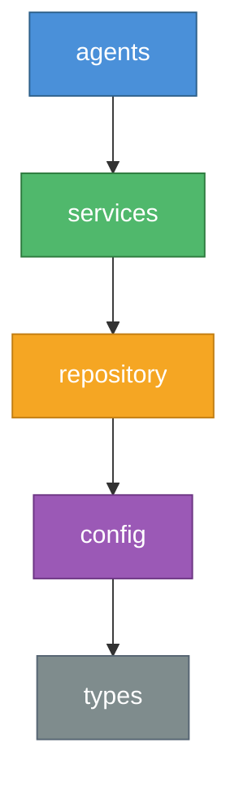

# Harness Engineering

[](https://github.com/Intense-Visions/harness-engineering/actions/workflows/ci.yml)
[](https://opensource.org/licenses/MIT)
[](https://pnpm.io/)

**Mechanical constraints for AI agents. Ship faster without the chaos.**

## Why This Exists

AI coding agents are powerful, but unreliable without structure. Left unconstrained, they introduce circular dependencies, violate architectural boundaries, and generate drift that compounds across a codebase. Teams respond with code review backlogs and manual checklists — trading agent speed for human bottlenecks.

Harness Engineering takes a different approach: **mechanical enforcement, not hope.**

Instead of relying on prompts and conventions, harness encodes your architectural decisions as machine-checkable constraints. Agents get real-time feedback when they violate boundaries. Entropy is detected and cleaned automatically. Every rule is validated on every change.

**For tech leads and architects:** Scale AI-assisted development across your team with confidence. Define constraints once, enforce them everywhere — across agents, developers, and CI.

**For individual developers:** Stop babysitting your AI agent. Give it guardrails and let it execute. Spend your time on design decisions, not cleanup.

## Key Features

- **Cross-Platform Support** — Fully tested on Windows, macOS, and Linux with mechanical enforcement preventing platform-specific regressions
- **Context Engineering** — Repository-as-documentation keeps agents grounded in project reality, not stale training data
- **Architectural Constraints** — Layered dependency rules enforced by ESLint, not willpower
- **Agent Feedback Loop** — Self-correcting agents with peer review and real-time validation
- **Entropy Management** — Automated detection of dead code, doc drift, and structural decay
- **Implementation Strategy** — Depth-first execution: one feature to 100% before the next begins
- **Key Performance Indicators** — Measure agent autonomy, harness coverage, and context density
- **Orchestrator Gateway API** — Token-scoped bearer auth on a versioned `/api/v1/*` surface with append-only audit log, three bridge-primitive endpoints (`jobs/maintenance`, `interactions/{id}/resolve`, `events` SSE), HMAC SHA-256-signed webhook subscriptions (`X-Harness-Signature: sha256=<hex>`) with event-bus fan-out, and a vendored OpenAPI artifact at [`docs/api/openapi.yaml`](docs/api/openapi.yaml). External bridges (Slack, Discord, GitHub Apps) build against a published, versioned contract instead of coupling to internals. See [ADR 0011](docs/knowledge/decisions/0011-orchestrator-gateway-api-contract.md). See [`examples/slack-echo-bridge/`](examples/slack-echo-bridge/) for the canonical reference consumer — a standalone Node bridge that verifies HMAC signatures and posts to Slack on `maintenance.completed`.
- **Session Search & Insights** — SQLite FTS5 index over `.harness/sessions/` and `.harness/archive/sessions/` with BM25 ranking; LLM-generated retrospective `llm-summary.md` written on session archive; composite `harness insights` aggregator combining health, entropy, decay, attention, and impact. New CLI commands `harness search "<query>"` and `harness insights`, plus MCP tools `search_sessions`, `summarize_session`, `insights_summary`. See [ADR 0013](docs/knowledge/decisions/0013-hermes-phase-1-session-memory-architecture.md).
- **Skill Proposals** — Agents emit skill candidates (new or refinement) via the `emit_skill_proposal` MCP tool; proposals queue in `.harness/proposals/` and route through a mechanical soundness gate before reviewer approval. Every skill carries `provenance: community | agent-proposed | user-authored`. CLI: `harness proposals list|show|approve|reject`. Dashboard review queue at `/s/proposals`. See [ADR 0016](docs/knowledge/decisions/0016-hermes-phase-4-skill-proposal-workflow.md).

## Quick Start

Pick the install path that matches how you use harness:

- **Claude Code users** → install the `harness-claude` marketplace plugin (recommended). Skills, slash commands, persona subagents, lifecycle hooks, and MCP are wired up automatically — no `harness setup` step.
- **Cursor users** → install the `harness-cursor` marketplace plugin (recommended). Same component surface as Claude, plus 4 curated project rules.
- **Gemini CLI users** → install the `harness-gemini` marketplace extension. Slash commands + GEMINI.md context + MCP. (Gemini extensions don't define a subagents or hooks field, so those surfaces live in GEMINI.md.)
- **Codex CLI users** → install the `harness-codex` marketplace plugin. Skills + MCP (Codex's plugin spec defines no slash-command or agents surface).
- **OpenCode users** → install the npm package and run `harness setup`. OpenCode auto-discovers `.claude/skills/` and shares Claude's skill tree, so the only setup work is wiring the harness MCP server into `opencode.json`, which `harness setup` does automatically once it detects `~/.config/opencode/` or a project-local `opencode.json`.
- **Plain CLI / CI users (or any tool not yet covered by a plugin)** → install the npm package. `harness setup` detects every supported AI client (Claude Code, Gemini CLI, Cursor, Codex CLI, OpenCode) and lays down skills, slash commands, agent personas, MCP, and hooks.

### 1a. Install via the Claude Code plugin marketplace (recommended for Claude Code sessions)

In a Claude Code session:

```
/plugin marketplace add Intense-Visions/harness-engineering
/plugin install harness-claude
```

This pulls every bundled skill (so trigger phrases like "scaffold a test suite" engage `initialize-test-suite-project` automatically), registers the `/harness:*` slash commands, installs the 12 persona subagents (`harness-code-reviewer`, `harness-architecture-enforcer`, …), wires the standard hook profile (block-no-verify, protect-config, quality-gate, pre-compact-state, adoption-tracker, telemetry-reporter), and starts the `harness` MCP server via `npx @harness-engineering/cli harness-mcp`. No per-repo `harness setup` is required.

### 1b. Install via the Cursor plugin marketplace (recommended for Cursor sessions)

In Cursor, open the marketplace and install `harness-cursor` from `Intense-Visions/harness-engineering`. Same skills, slash commands, subagents, hooks, and MCP server as the Claude plugin, plus 4 curated project rules (validate-before-commit, respect-architecture, use-harness-skills, respect-hooks) that fire automatically as `alwaysApply` rules in every Cursor session in this repo.

### 1c. Install via npm (for plain CLI use, or for AI tools without a marketplace plugin)

```bash
npm install -g @harness-engineering/cli
harness setup
```

This installs the CLI and runs interactive setup: generates global slash commands and agent personas for all detected AI clients (Claude Code, Gemini CLI, Cursor, Codex CLI), configures MCP servers, and sets up peer integrations. Once set up, every project on your machine has access to `/harness:*` slash commands, agent personas, and the `harness-mcp` server binary — no per-project setup needed.

> **Tip:** Re-run `harness setup` after updating the CLI (`harness update`) to pick up new or changed skills. Marketplace plugin users update via `/plugin update harness-claude` (or `harness-cursor`).

### Plugin vs. npm: what you actually get

The marketplace plugins are the **agent-session interface**. The npm package is what you need for shell-level workflows. Pick based on where you actually use harness:

| Surface                                                                                                | `harness-claude` / `harness-cursor` plugin (after `/harness:initialize-project` runs once per repo) | `npm install -g @harness-engineering/cli` (after `harness setup`)                                                                                                        |
| ------------------------------------------------------------------------------------------------------ | --------------------------------------------------------------------------------------------------- | ------------------------------------------------------------------------------------------------------------------------------------------------------------------------ |
| Inside a Claude Code or Cursor session — skills, `/harness:*`, subagents, hooks, MCP tools             | ✅ full parity                                                                                      | ✅ same                                                                                                                                                                  |
| Cursor project rules (validate-before-commit, respect-architecture, use-harness-skills, respect-hooks) | ✅ shipped with `harness-cursor`                                                                    | ❌ Cursor-only feature                                                                                                                                                   |
| Adoption tracking + anonymous telemetry (hooks fire, defaults enabled)                                 | ✅ works                                                                                            | ✅ works                                                                                                                                                                 |
| Project bootstrap (`harness.config.json`, `.harness/` scaffolding)                                     | ✅ via `/harness:initialize-project` (Phase 2)                                                      | ✅ via `harness init` / `harness setup`                                                                                                                                  |
| Knowledge graph (`.harness/graph/`)                                                                    | ✅ via `/harness:initialize-project` (Phase 5 step 1)                                               | ✅ initial scan during `harness setup`                                                                                                                                   |
| Architecture / performance baselines                                                                   | ✅ via `/harness:initialize-project` (Phase 5 steps 2–3)                                            | ✅ auto-refreshed on main via CI                                                                                                                                         |
| Telemetry **identity** tagging (project / team / alias)                                                | ✅ via `/harness:initialize-project` (Phase 5 step 4)                                               | ✅ via interactive telemetry wizard                                                                                                                                      |
| Legacy layout migration warnings (`docs/plans/`, `.harness/architecture/`)                             | ✅ via `/harness:initialize-project` (Phase 5 step 5)                                               | ✅ surfaced during `harness setup`                                                                                                                                       |
| Tier-0 MCP integrations (context7, sequential-thinking, playwright) added to project `.mcp.json`       | ✅ via `/harness:initialize-project` (Phase 5 step 6)                                               | ✅ wired during interactive setup                                                                                                                                        |
| Tier-1 API-key integrations (Linear, Slack, Perplexity, …)                                             | ⚠️ surfaced by `harness integrations list`; user wires via `npx … add <name>`                       | ⚠️ same — API keys required either way                                                                                                                                   |
| Gemini CLI / Codex integration                                                                         | ✅ via sibling marketplace plugins (`harness-gemini`, `harness-codex`)                              | ✅ `harness setup` configures all detected clients                                                                                                                       |
| OpenCode integration                                                                                   | ⚠️ no OpenCode-native plugin manifest (OpenCode uses code-based plugins, not marketplace JSON)      | ✅ `harness setup` writes `opencode.json` with the harness MCP server (and Tier-0 integrations) when `~/.config/opencode/` or a project-local `opencode.json` is present |
| Terminal use — `harness validate`, `harness init`, `harness check-arch`                                | ⚠️ only via `npx @harness-engineering/cli <cmd>`                                                    | ✅ binary in PATH                                                                                                                                                        |
| CI workflows (GitHub Actions, etc.)                                                                    | ⚠️ workable via `npx` (cold-start cost per job)                                                     | ✅ `npm install -g` once, fast thereafter                                                                                                                                |
| Git pre-commit hooks (`harness validate` on commit)                                                    | ⚠️ npx-based, slow                                                                                  | ✅ direct binary, fast                                                                                                                                                   |

**TL;DR**: run `/harness:initialize-project` once per repo and the plugin covers ~95% of what `harness setup` does — the skill's Phase 5 (INSTRUMENT) closes the bootstrap gap. The remaining ~5% (multi-tool MCP wiring, fast CI/terminal access without npx cold-start) is what `npm install -g` fills. They coexist cleanly.

#### Telemetry on plugin-only installs

Adoption tracking and anonymous telemetry hooks ship in the standard hook profile, so they fire on plugin install with no extra setup. They default-enable but a privacy notice prints to stderr on first run. Opt out at any time:

```bash
# Per-shell
export DO_NOT_TRACK=1
# Or per-project, in harness.config.json:
#   { "telemetry": { "enabled": false }, "adoption": { "enabled": false } }
```

For identity-tagged telemetry (project/team/alias), run the interactive wizard once via `npx @harness-engineering/cli telemetry-wizard` — the plugin doesn't ship an interactive equivalent.

#### Updates

Plugin users have two update channels that can drift slightly:

- **Bundled artifacts** (skills, slash commands, subagents, hooks) ship from this git repo. Update via `/plugin update harness-claude`.
- **MCP server binary** is launched via `npx -y -p @harness-engineering/cli@latest harness-mcp`, so each new session pulls the latest published npm version (subject to npx's ~24h cache).

In practice they stay close together because npm publishes follow git tags. If you need them locked in step (e.g. for a release window), `npm install -g @harness-engineering/cli` and use `harness setup` instead.

#### Shell-from-plugin escape hatch

If you only have the plugin installed and need a shell-level harness command, `npx` works without a global install:

```bash
npx @harness-engineering/cli validate
npx @harness-engineering/cli check-deps
npx @harness-engineering/cli check-arch
```

First call is slow (npx fetches the package); subsequent calls within the cache window are fast. For frequent terminal use, `npm install -g` is still the better path.

### 2. Scaffold a new project

In an AI agent session (Claude Code, Gemini CLI):

```
/harness:initialize-project
```

The initialization skill walks you through project setup interactively — name, adoption level, framework overlay — and scaffolds everything including MCP server configuration.

> **CLI alternative** (for scripts or CI): `harness init --name my-project --level intermediate`

### 3. Validate

```
/harness:verify
```

Runs all mechanical checks in one pass — configuration, dependency boundaries, lint, typecheck, and tests.

> **CLI alternative:** `harness validate && harness check-deps`

### Explore an example

```bash
git clone https://github.com/Intense-Visions/harness-engineering.git
cd harness-engineering/examples/hello-world
npm install && harness validate
```

## Packages

| Package                                                          | Description                                                                                                                                                                                                                                                                               |
| ---------------------------------------------------------------- | ----------------------------------------------------------------------------------------------------------------------------------------------------------------------------------------------------------------------------------------------------------------------------------------- |
| [`@harness-engineering/types`](./packages/types)                 | Shared TypeScript types and interfaces                                                                                                                                                                                                                                                    |
| [`@harness-engineering/core`](./packages/core)                   | Validation, constraints, entropy detection, state management                                                                                                                                                                                                                              |
| [`@harness-engineering/cli`](./packages/cli)                     | CLI: `validate`, `check-deps`, `skill run`, `state show`                                                                                                                                                                                                                                  |
| [`@harness-engineering/eslint-plugin`](./packages/eslint-plugin) | 12 rules: layer violations, circular deps, forbidden imports, boundary schemas, doc exports, no nested loops in critical paths, no sync IO in async, no unbounded array chains, no unix shell commands, no hardcoded path separators, require path normalization, no process env in spawn |
| [`@harness-engineering/linter-gen`](./packages/linter-gen)       | Generate custom ESLint rules from YAML configuration                                                                                                                                                                                                                                      |
| [`@harness-engineering/graph`](./packages/graph)                 | Knowledge graph for codebase relationships and entropy detection                                                                                                                                                                                                                          |
| [`@harness-engineering/intelligence`](./packages/intelligence)   | Intelligence pipeline for spec enrichment, complexity modeling, and pre-execution simulation                                                                                                                                                                                              |
| [`@harness-engineering/orchestrator`](./packages/orchestrator)   | Agent orchestration daemon for dispatching coding agents to issues                                                                                                                                                                                                                        |
| [`@harness-engineering/dashboard`](./packages/dashboard)         | Local web dashboard for project health and roadmap visualization                                                                                                                                                                                                                          |

## Usage

```typescript
import { validateFileStructure } from '@harness-engineering/core';

const result = await validateFileStructure('/path/to/project');
if (!result.ok) {
  console.error('Validation failed:', result.error.message);
  process.exit(1);
}
```

```bash
# CLI — validate project constraints
harness validate

# Check architectural dependency boundaries
harness check-deps

# Run a skill
harness skill run harness-verification
```

See [Getting Started](./docs/guides/getting-started.md) for a full walkthrough.

## Architecture

Harness enforces a strict layered dependency model. Each layer may only import from layers below it.



Violations are caught at lint time via `@harness-engineering/eslint-plugin` — not at code review.

## AI Agent Integration

### Global setup (one-time)

Install the CLI, MCP server, skills, and personas so they're available in every project:

```bash
npm install -g @harness-engineering/cli
harness setup
```

The single `npm install -g` provides both the `harness` CLI and the `harness-mcp` server binary, with all dependencies version-matched. `harness setup` then detects installed AI clients and writes to your global config directories:

| Platform    | Slash Commands        | Agent Definitions |
| ----------- | --------------------- | ----------------- |
| Claude Code | `~/.claude/commands/` | `.claude/agents/` |
| Gemini CLI  | `~/.gemini/commands/` | `.gemini/agents/` |
| Cursor      | `~/.cursor/rules/`    | —                 |
| Codex CLI   | `~/.codex/`           | —                 |

After this, `/harness:*` slash commands and harness agent personas are available in every conversation — no per-project install needed.

### Per-project MCP server

For real-time constraint validation, connect the MCP server to your project. The easiest way is during initialization:

```
/harness:initialize-project
```

This scaffolds your project **and** configures the MCP server automatically.

To add the MCP server to an existing project:

```bash
harness setup-mcp
```

This gives your AI agent access to 62 tools (validation, entropy detection, skill execution, state management, code review, graph queries, and more) and 9 resources (project context, skills catalog, rules, learnings, state, graph, entities, relationships, business-knowledge).

<details>
<summary>Manual MCP setup</summary>

**Claude Code** — add to `.mcp.json` in your project root:

```json
{
  "mcpServers": {
    "harness": {
      "command": "harness-mcp"
    }
  }
}
```

**Gemini CLI** — add to `.gemini/settings.json` in your project root:

```json
{
  "mcpServers": {
    "harness": {
      "command": "harness-mcp"
    }
  }
}
```

Then add your project directory to `~/.gemini/trustedFolders.json` (Gemini ignores workspace MCP servers in untrusted folders):

```json
{
  "/path/to/your/project": "TRUST_FOLDER"
}
```

**Cursor** — add to `.cursor/mcp.json` in your project root:

```json
{
  "mcpServers": {
    "harness": {
      "command": "harness",
      "args": ["mcp"]
    }
  }
}
```

**Codex CLI** — add to `.codex/config.toml` in your project root:

```toml
[mcp_servers.harness]
command = "harness"
args = ["mcp"]
enabled = true
```

**OpenCode** — add to `opencode.json` in your project root:

```json
{
  "$schema": "https://opencode.ai/config.json",
  "mcp": {
    "harness": {
      "type": "local",
      "command": ["harness", "mcp"],
      "enabled": true
    }
  }
}
```

> **Note:** `harness-mcp` is installed alongside the CLI by `npm install -g @harness-engineering/cli`. Using the installed binary instead of `npx @harness-engineering/mcp-server` avoids stale npx cache issues and ensures the MCP server uses the same package versions as the CLI.

</details>

| Client      | MCP Config Location     | Additional Setup                                     |
| ----------- | ----------------------- | ---------------------------------------------------- |
| Claude Code | `.mcp.json`             | None                                                 |
| Gemini CLI  | `.gemini/settings.json` | Add project to `~/.gemini/trustedFolders.json`       |
| Cursor      | `.cursor/mcp.json`      | None                                                 |
| Codex CLI   | `.codex/config.toml`    | None                                                 |
| OpenCode    | `opencode.json`         | None — skills auto-discovered from `.claude/skills/` |

## What's Included

| Component                              | Count | Description                                                                                                    |
| -------------------------------------- | ----- | -------------------------------------------------------------------------------------------------------------- |
| [Packages](./packages/)                | 9     | Core library, CLI, ESLint plugin, linter generator, graph, intelligence, orchestrator, dashboard, shared types |
| [Skills](./agents/skills/claude-code/) | 741   | Agent workflows across 3 tiers: workflow, maintenance, and domain catalog                                      |
| [Personas](./agents/personas/)         | 12    | Architecture enforcer, code reviewer, planner, verifier, task executor, and 7 more                             |
| [Templates](./templates/)              | 19    | Language bases, framework overlays (Express, NestJS, Django, FastAPI, Gin, Axum, Spring Boot, and more)        |
| [Examples](./examples/)                | 3     | Progressive tutorials from 5 minutes to 30 minutes                                                             |

## Examples

Learn by doing. Each example builds on the previous:

| Example                                          | Level        | Time   | What You Learn                                                               |
| ------------------------------------------------ | ------------ | ------ | ---------------------------------------------------------------------------- |
| [Hello World](./examples/hello-world/)           | Basic        | 5 min  | Config, validation, AGENTS.md — see what a harness project looks like        |
| [Task API](./examples/task-api/)                 | Intermediate | 15 min | Express API with 3-layer architecture enforced by ESLint                     |
| [Multi-Tenant API](./examples/multi-tenant-api/) | Advanced     | 30 min | Custom linter rules, Zod boundary validation, personas, full state lifecycle |

## Documentation

**Getting Started**

- [Getting Started Guide](./docs/guides/getting-started.md) — From zero to validated project
- [Day-to-Day Workflow](./docs/guides/day-to-day-workflow.md) — Full lifecycle tutorial using slash commands
- [Best Practices](./docs/guides/best-practices.md) — Patterns for effective harness usage
- [Agent Worktree Patterns](./docs/guides/agent-worktree-patterns.md) — Running multiple agents in parallel

**Core Concepts**

- [The Core Principles](./docs/standard/principles.md) — Foundational concepts behind harness engineering
- [Implementation Guide](./docs/standard/implementation.md) — Adoption levels and rollout strategy
- [KPIs](./docs/standard/kpis.md) — Measuring agent effectiveness

**Reference**

- [CLI Reference](./docs/reference/cli.md) — All commands and flags (for CI/scripts)
- [Configuration Reference](./docs/reference/configuration.md) — `harness.config.json` schema

## Inspirations

| Project                                                        | Key Contribution                                                       |
| -------------------------------------------------------------- | ---------------------------------------------------------------------- |
| [GitHub Spec Kit](https://github.com/nicholasgubbins/spec-kit) | Constitution/principles, cross-artifact validation                     |
| [BMAD Method](https://github.com/bmadcode/BMAD-METHOD)         | Scale-adaptive intelligence, workflow re-entry, party mode             |
| [GSD](https://github.com/coleam00/gsd)                         | Goal-backward verification, persistent state, codebase mapping         |
| [Superpowers](https://github.com/jlowin/superpowers)           | Rigid behavioral workflows, subagent dispatch, verification discipline |
| [Ralph Loop](https://github.com/PlusNowhere/ralph-loop)        | Fresh-context iteration, append-only learnings, task sizing            |

These five projects most directly shaped harness engineering. See the full [Inspirations & Acknowledgments](./docs/inspirations.md) for all 50 projects, standards, and tools analyzed — what we adopted, what we skipped, and why.

## Contributing

See [CONTRIBUTING.md](./CONTRIBUTING.md) for development setup, coding standards, and pull request guidelines.

## License

MIT License — see [LICENSE](./LICENSE) for details.
